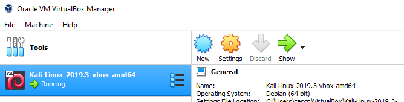
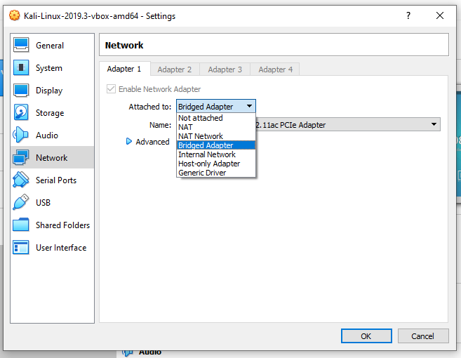
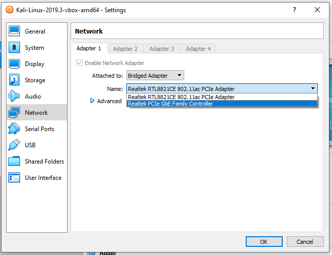

# Introdução e configurações

O [Kali](https://www.kali.org/) é um sistema operativo *Open Source* usado para treino de segurança e testes de penetração.

Antes de usarmos esta ferramenta, devemos garantir que a máquina virtual Kali tem acesso direto à rede do laboratório. Para isso, devemos **ligar o portátil à rede** (por Ethernet ou por Wi-Fi) e dar acesso bridge a essa interface de rede.


### Autenticação Wi-Fi

Para quem não puder usar Ethernet, foram criados dois *Access Points Wi-Fi*.

 - Na sala **i321** deve-se usar a rede ```netlabwifi```
 - Na sala **i322** deve-se usar a rede ```netlabwifi2```

A password do AP é a password de root dos servidores das bancadas.

### Acesso *bridge* à interface de rede

No VirtualBox, deve-se ir às definições da máquina virtual.



De seguida, em "Network", escolher o modo "Bridged Adapter".



E escolher a interface pretendida (Ethernet ou Wi-Fi, consoante o caso).



Qualquer dúvida, peçam ajuda! :wink:

 ---
 [Voltar](../README.md)