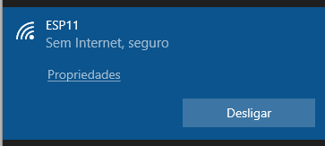
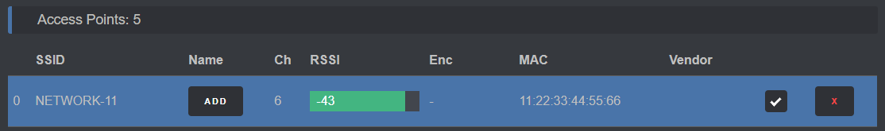
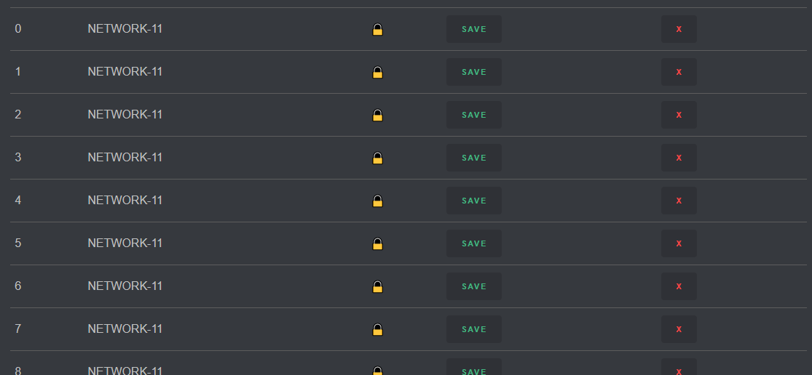
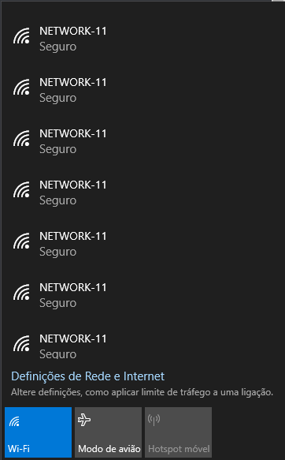

# Redes de acesso sem fio 802.11

Equipamento:  
- Placas baseadas em ESP8266 - [NodeMCU](https://google.com/search?q=NodeMCU) ou [WeMos D1 Mini](https://google.com/search?q=WeMos%20D1%20Mini)  
     - Estas estarão *flashadas* previamente com o [ESP8266 Deauther 2.0](https://github.com/spacehuhn/esp8266_deauther)
     - Se possível, **trazer cabo Micro USB** para alimentar as placas
- Placa de rede [TP Link](https://google.com/search?q=TP%20Link%20kali) compatível com Kali Linux  
     - **Trazer computador com Kali instalado numa VM**
- Placas wireless linux do netlab

Nesta sessão iremos explorar a segurança de redes *wireless*, através das quatro atividades apresentadas abaixo.  
Estas atividades devem ser realizadas por ordem (o grau de complexidade vai aumentando), com os participantes agrupados por bancadas. 


Quem não esteve presente na sessão anterior, deverá assinar a declaração de ética entregue no início.

## SSID Spoofing & Deauth Attacks

Um dos ataques mais simples às redes sem fio é o **SSID Spoofing**, que consiste em criar/publicitar redes falsas em grande número. Isto pode servir para induzir os utilizadores em erro, para causar *overhead* ou congestão no meio, etc.  
Para este ataque vamos usar placas baseadas em ESP8266. O ESP8266 é um microcontrolador capaz de se conectar a redes Wi-Fi (como cliente), ou de criar a sua própria rede (como *Access Point*), sendo muito usado para aplicações de Internet of Things (IoT), mas que também pode ser usado para outros fins.

Cada bancada terá o seu próprio ESP, que deve ser alimentado por USB.  
De seguida, deve-se procurar a rede Wi-Fi que está a ser difundida por este dispositivo, e ligar-se a ela. Esta rede será designada ```ESP1X``` para a sala I321 e ```ESP2X``` para I320, X sendo o número da bancada.



Depois de conectados, devem aceder à página http://192.168.4.1 e começar a explorar.

Em cada bancada existe um *Access Point* Wi-Fi, que será a vítima do *SSID Spoofing*, ```NETWORK-XY```.  
Começar por fazer scan de APs, seguindo as instruções da página. Depois, selecionar a caixa correspondente à vítima.



Na página de SSIDs, escolher "Clone selected APs", e "Reload" para confirmar as alterações.



Por fim, em "Attacks", começar um ataque do tipo "Beacon".



Talvez um utilizador normal tenha alguma dificuldade em encontrar a rede verdadeira agora...  
Podem explorar um pouco mais este dispositivo e os ataques que se podem fazer com ele.  
Ao terminarem, lembrem-se apenas de parar o ataque ou desligar o ESP, para facilitar os próximos passos.

Se precisarem, podem pedir ajuda, mas muitos problemas normalmente resolvem-se ao reiniciar o ESP.  
Eventualmente deverá surgir a rede ```GUEST-WEP-XY```, que será a vítima do ataque seguinte.

### Mais informação
Mais informação e ajuda em https://github.com/spacehuhn/esp8266_deauther/wiki.  
O Google também é sempre útil, mas se quiserem procurar informação online durante este Workshop talvez seja melhor usar dados móveis. :slightly_smiling_face:

## WEP

Atacar AP com autenticação WEP (ultrapassada). Placa Linux como AP WEP, TP link para ataque.

## WPA

Atacar AP com autenticação WPA (o que se usa em casa). Placa Linux como AP WPA, TP link para ataque.

## 802.1X PEAP

Atacar AP com autenticação 802.1X PEAP (o que se usa na eduroam).

## Monitorização

Wireshark, monitoring mode.
 
 
